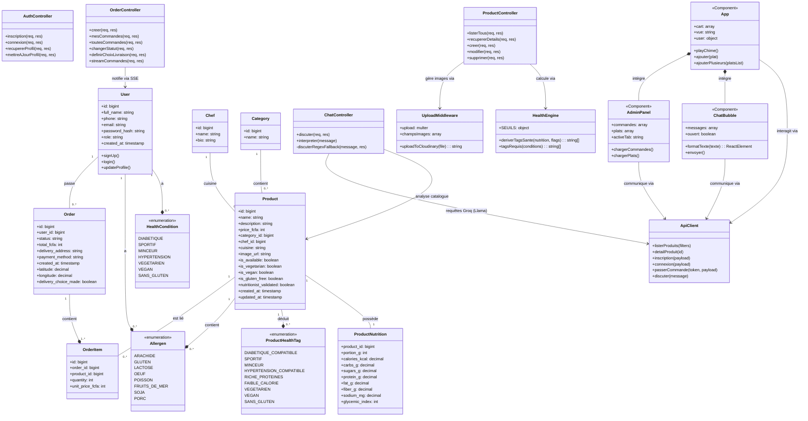

# Diagramme de Classes — Mboa Resto

Ce document présente l'architecture orientée objet, le modèle de données relationnel ainsi que l'interaction entre les composants frontend et backend de l'application **Mboa Resto**.

---

## 1. Diagramme de Classes (Mermaid)

Le diagramme ci-dessous illustre la structure des données (tables relationnelles modélisées en classes), les modules du serveur backend et les composants clés de l'application frontend.

---

## 2. Description des Entités Principales

### A. Modèle de Données (Base de données MySQL)
1. **`User`** : Représente les utilisateurs de la plateforme (clients et administrateurs). Un utilisateur peut être lié à plusieurs conditions de santé (`HealthCondition`) et allergies (`Allergen`).
2. **`Product`** : Représente les plats proposés au menu. Chaque plat possède un ensemble d'indicateurs de base (`is_vegetarian`, etc.) saisis par l'administrateur, et un profil nutritionnel précis.
3. **`ProductNutrition`** : Contient les valeurs nutritionnelles par portion d'un plat (index glycémique, sucres, sodium, calories, etc.). C'est à partir de cette table que les tags de santé sont déduits.
4. **`ProductHealthTag`** : Les tags de compatibilité santé calculés automatiquement par le serveur en temps réel via le **`HealthEngine`**. Cela évite les erreurs humaines lors de la saisie des compatibilités (ex. un plat n'est tagué *Sportif* que s'il respecte le seuil minimum de protéines).
5. **`Order`** & **`OrderItem`** : Représentent les commandes des clients et leur contenu. Elles stockent également les coordonnées géographiques (`latitude`, `longitude`) de livraison.

### B. Contrôleurs & Logique Backend (Node.js)
1. **`HealthEngine`** : C'est le cœur clinique de l'application. Il contient les seuils nutritionnels de référence (ex. index glycémique $\le 55$ pour le diabète) et calcule de façon algorithmique les tags de chaque plat.
2. **`ChatController`** : Gère l'assistant virtuel. Si configuré, il transmet les messages des clients à l'API **Groq** avec le modèle de raisonnement **`llama-3.3-70b-versatile`** en y adjoignant la liste complète des plats disponibles pour que l'IA puisse raisonner et conseiller de manière personnalisée et scientifiquement justifiée.
3. **`OrderController`** : Traite les commandes et gère le canal **SSE (Server-Sent Events)** pour envoyer instantanément des alertes sonores et des notifications aux administrateurs lors de la réception d'une commande.

### C. Interface Utilisateur Frontend (React / Vite)
1. **`App`** : Point central de l'interface qui coordonne l'état du panier (cart), l'authentification de l'utilisateur et gère la connexion SSE en temps réel.
2. **`ChatBubble`** : Interface de messagerie PWA compacte et stylisée. Elle comprend un parseur markdown interne (`formatTexte`) pour éliminer les astérisques bruts et afficher du texte enrichi (gras, listes à puces) ainsi que des actions rapides (Ajout collectif au panier et validation de commande).
3. **`AdminPanel`** : Tableau de bord de l'administrateur permettant de gérer les statistiques financières, le statut des commandes et l'édition de la carte.
