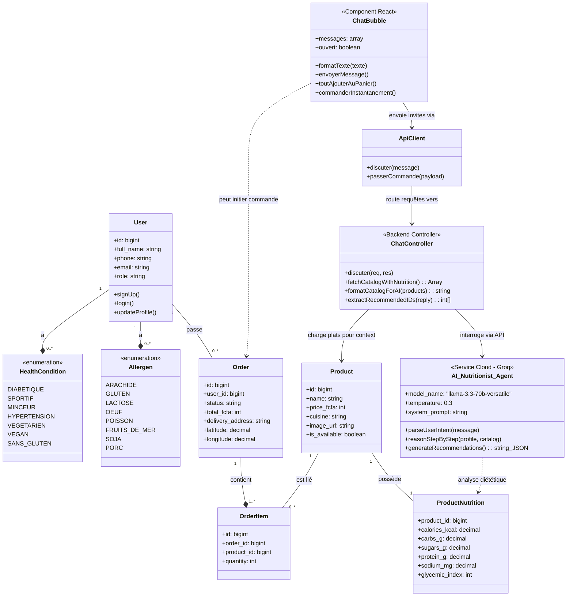
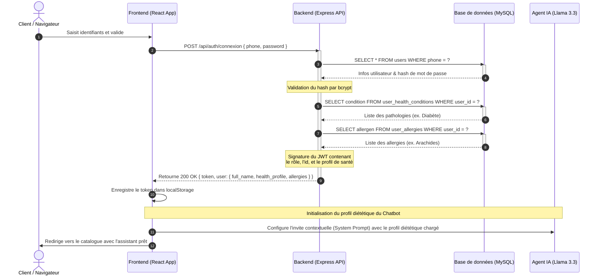
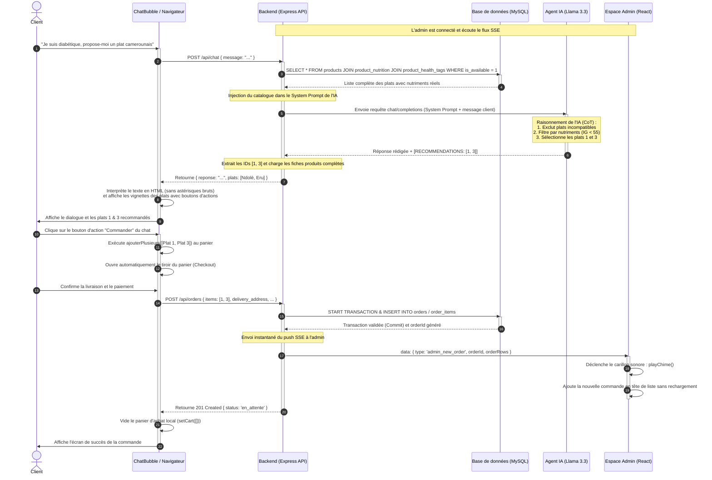

# Modélisation UML & Captures d'Écran — Mboa Resto

Ce document rassemble les versions révisées du diagramme de classes et des deux diagrammes de séquences, en y intégrant l'**IA Nutritionniste (Modèle Llama 3.3 via Groq)** comme un acteur ou entité centrale du système. Il fournit également une description détaillée de chaque capture d'écran pour agrémenter le rapport.

---

## 1. Diagramme de Classes Révisé (avec IA intégrée)

Le diagramme de classes ci-dessous montre comment l'agent IA (`AI_Nutritionist_Agent`) s'interface avec le reste de l'application en consommant le catalogue des plats (`Product`) et leurs valeurs nutritionnelles pour répondre aux requêtes personnalisées des utilisateurs.

---

## 2. Diagramme de Séquence : S'Authentifier & Initialiser l'IA

Ce diagramme montre comment la connexion de l'utilisateur charge son profil médical et ses restrictions d'allergies pour configurer l'**IA Nutritionniste** en temps réel, garantissant des réponses adaptées dès le premier message.

---

## 3. Diagramme de Séquence : Dialogue IA -> Recommandation -> Commande & SSE

Ce diagramme illustre le parcours d'achat assisté par l'IA : dialogue, raisonnement clinique de l'IA, recommandation visuelle de plats, ajout collectif au panier d'un clic, validation de commande, transaction BDD, et émission de l'alerte sonore SSE vers l'administrateur.

---

## 4. Description des Captures d'Écran pour le Rapport

Voici les descriptions textuelles détaillées à intégrer dans la **Section 2 du Chapitre 4 (Présentation de l'application)** de votre rapport pour justifier les images :

* **Figure 7 – Écran d'accueil & Hero Banner** : Affiche la page d'accueil de l'application conçue pour faire forte impression (Hero Banner haut de gamme). Le titre accrocheur (« La cuisine camerounaise qui vous correspond ») et le sous-titre explicatif sont directement superposés sur des images rotatives de spécialités locales (cuit sans excès d'huile, Ndolè, Poulet DG). L'opacité des images de fond est calée à 65% pour garantir un contraste élevé et une lisibilité parfaite des textes blancs, éliminant toute boîte de flou (frosted card) obstructive.
* **Figure 8 – Bannière d'installation PWA (Android & iOS)** : Illustre le système d'installation autonome de l'application sur l'écran d'accueil du mobile. Sur Android, un bouton d'installation directe est affiché grâce à l'événement `beforeinstallprompt`. Sur iOS/Safari (détection en mode standalone), un guide illustré s'affiche de manière conviviale pour indiquer au client les actions à mener (cliquer sur Partager puis sur « Sur l'écran d'accueil ») pour disposer de l'application hors ligne avec le logo officiel de Mboa.
* **Figure 9 – Inscription Client & Déclaration de Santé** : Capture d'écran de l'interface d'inscription. En plus des informations classiques (nom, numéro de téléphone), le formulaire propose des cases à cocher permettant au client d'indiquer ses contraintes de santé (diabétique, hypertendu, sportif, etc.) et ses allergies alimentaires (arachide, lactose, porc). Ces critères alimenteront le moteur de filtrage pour adapter la carte.
* **Figure 10 – Catalogue de plats validés par la nutrition** : Affiche la grille du menu principal de Mboa Resto. Les plats de la cuisine camerounaise (Ndolè, Eru, etc.) apparaissent sous forme de cartes élégantes avec leur prix en FCFA, leur photo hébergée sur Cloudinary et, de façon proéminente, des badges de compatibilité couleur (ex: « Diabète OK », « Tension OK ») qui sont le fruit des calculs algorithmiques du moteur clinique, attestant d'une carte validée diététiquement.
* **Figure 11 – Bulle d'assistant nutritionnel intelligent (IA Llama 3.3)** : Affiche la fenêtre de discussion compacte (330x450px) avec l'IA. On y voit des conseils nutritionnels formulés en français correct dans des paragraphes courts de 1 à 2 lignes (très faciles à lire, sans astérisques ni puces bruts grâce au parseur markdown). L'IA recommande des plats du menu qui s'affichent sous forme de vignettes miniatures à l'intérieur du chat avec des boutons interactifs permettant de tout ajouter au panier ou de commander instantanément.
* **Figure 12 – Tiroir de Panier & Choix de livraison géolocalisé** : Capture d'écran du volet de commande (Cart Drawer) et de son modal interactif. Le client y voit le récapitulatif de ses plats et peut cliquer sur le bouton de géolocalisation pour ouvrir une carte OpenStreetMap interactive (via Leaflet) afin de placer manuellement son point de livraison précis (coordonnées GPS latitude et longitude enregistrées en base de données).
* **Figure 13 – Tableau de bord de l'administrateur en temps réel (SSE)** : Console d'administration centrale montrant les revenus, les statistiques et le flux des commandes de la journée. Un carillon audio retentit et l'affichage se met à jour en temps réel à la seconde près dès qu'une commande est soumise par un client, sans aucune actualisation de page, grâce au canal Server-Sent Events (SSE).
* **Figure 14 – Gestion de la carte & Calcul diététique (Admin)** : Interface permettant à l'administrateur d'éditer la carte des plats. L'admin importe l'image du plat (envoyée automatiquement sur Cloudinary) et saisit les valeurs nutritionnelles réelles du plat (calories, index glycémique, sodium, protéines). L'algorithme calcule instantanément en arrière-plan les tags de santé correspondants avant l'enregistrement.
* **Figure 15 – Formulaire de notation et d'avis client** : Vue modale s'affichant pour le client après la réception de sa commande. Le client peut évaluer l'application et la qualité gustative des plats en sélectionnant de 1 à 5 étoiles et en saisissant un retour d'expérience textuel, que l'administrateur peut ensuite consulter pour améliorer les recettes.
