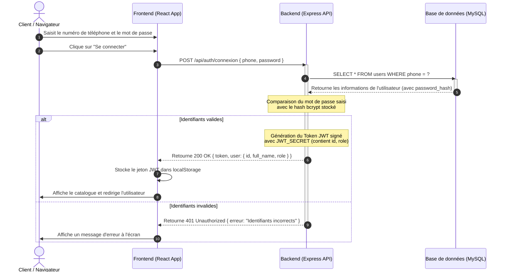
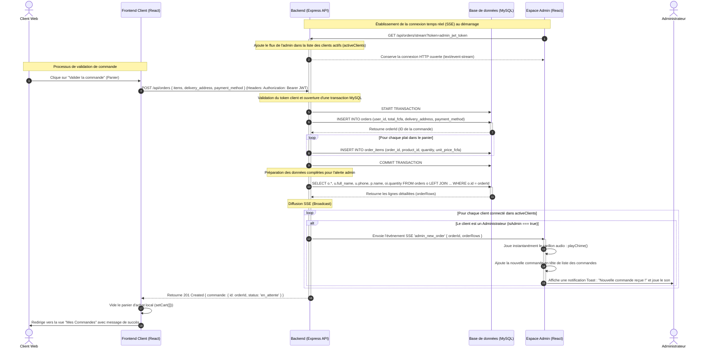

# Diagrammes de Séquences — Mboa Resto

Ce document contient les diagrammes de séquences UML modélisés en syntaxe **Mermaid** pour les deux cas d'utilisation clés de l'application **Mboa Resto**.

---

## 1. Diagramme de Séquence : S'Authentifier

Ce diagramme montre l'interaction entre le navigateur (Client/Frontend), le serveur d'API (Backend) et la base de données MySQL avec génération et validation d'un jeton JWT.

---

## 2. Diagramme de Séquence : Passer une commande et Notification SSE en temps réel

Ce diagramme illustre le processus complet d'achat. Il détaille comment la validation de la commande par un client déclenche instantanément le traitement transactionnel en base de données, suivi d'une notification push via **Server-Sent Events (SSE)** qui joue un carillon sonore et met à jour dynamiquement l'interface de l'administrateur sans rechargement.

